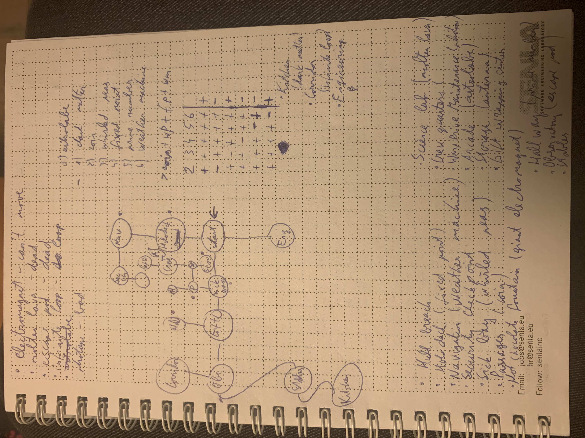

# Day 25: Cryostasis

[Problem description](https://adventofcode.com/2019/day/25)

## Running the program
```
python3 sol.py
```

## Language
[Python](https://en.wikipedia.org/wiki/Python_(programming_language))

## Notes
This was by far the most fun challenge for me this year :) I am absolutely
amazed of what the creator of AoC has done with the IntCode language and I'm
very thankful for such a fun experience.

I solved today's puzzle half by hand, half by writing a program. I started
by simple running the input program to see what it does. After seeing the
interactions and the output, I decided that it would be too difficult to
handle all cases of exploring the game area programatically, so I started
mapping everything out on a piece of paper. For each room I noted the name of
it, the directions where there are doors and names of the items in that room.
My final sketch looked like this:



After figuring out the whole map, I wrote down the list of steps required
to get all the (non lethal) items and put that into a script. The logic
after that was simple: try every possible combination of items in the
security checkpoint until a combination succeeds. For this I wrote a simple
Python script (I'm so happy I managed to save this language for the last
problem), which generate all possible combinations of the items and
then tries to use each of them one by one.

